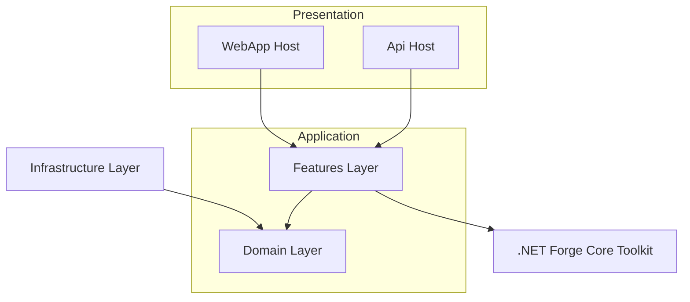
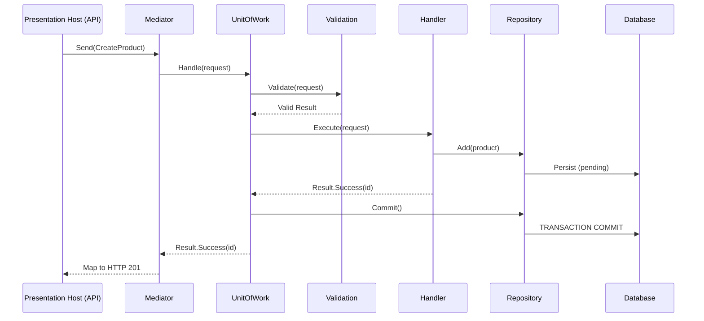

# Framework Architecture Design Document: Fused Slice Architecture

Version: 0.2 (Living Document)

Changelog 0.2:
 
* Added multi-ORM repository + unit of work flexibility (EF Core primary; Dapper/Linq2Db optional).
* Clarified post-commit domain event dispatch via pipeline behavior.
* Added optional gRPC + Aspire hosting guidance and client generation (Refit / Kiota / manual HttpClient) philosophy.
* Emphasized composition over inheritance for extensibility.

## 1. Philosophy and Introduction

The **Fused Slice Architecture (FSA)** is a pragmatic and highly cohesive architectural style for building modern .NET applications. It is an evolution of Vertical Slice Architecture, designed to solve several key challenges in modern software development:

* **Reducing Cognitive Load:** By co-locating all related code for a single feature, developers can understand and modify a use case without navigating a complex folder structure.
* **Maximizing Cohesion:** It keeps code that changes together, together. This makes features easier to maintain, refactor, and even delete.
* **Enhancing Developer Productivity:** Finding and working on a feature becomes trivial. The "go to definition" of a feature is a single file.
* **Optimizing for AI Collaboration:** The context-rich, single-file structure of a feature slice makes the codebase exceptionally easy for AI agents to parse, understand, and modify, streamlining development and maintenance.

This architecture is built on a foundation of familiar, standard project layers, making it **recognizable on the outside, but revolutionary on the inside**.

## 2. Architectural Layers

The project is organized into standard, recognizable layers. The "magic" of FSA lies in the strict rules governing the internal structure and interaction of these layers.

### Mermaid Diagram: Architectural Layers



#### ASCII Fallback: Architectural Layers

```text
                        +-----------------------------+
                        |        Presentation         |
                        |  +---------+  +-----------+ |
Incoming HTTP/gRPC ---> |  |  API    |  |  WebApp   | | ---> (Thin adapters map to mediator)
                        +-----+-----------+-----------+
                              |           |
                              v           v
                          ( Mediator / Pipeline )
                                   |
                                   v
        +---------------------------------------------------------+
        |                     Application                         |
        |  +------------------+      +--------------------------+ |
        |  |   Features       | ---> |         Domain           | |
        |  |  (Fused Slices)  |      | (Entities, VOs, Events)  | |
        |  +------------------+      +--------------------------+ |
        +------------------------------^--------------------------+
                                       |
                                       | (Implements abstractions / specs)
            +--------------------------+---------------------------+
            |                      Infrastructure                 |
            | (EF Core, Repos, Specs Eval, Outbox, Integrations)  |
            +--------------------------+---------------------------+
                                       |
                                       v
                          +------------------------------+
                          |     NetForge Core Toolkit    |
                          | (Mediator, Result, Spec, etc)|
                          +------------------------------+
```

### Layer Responsibilities

* **`Domain` Layer:** Contains the core of your business logic. This includes domain entities, value objects, smart enums, and repository interfaces. This layer has zero external dependencies.
* **`Features` Layer:** Application use cases fused per feature. **Unique Principle:** A single self-contained `[FeatureName]Feature.cs` file holds request/response types, validators, handlers, DTOs, and internal mappers.
* **`Infrastructure` Layer:** Implements `Domain` abstractions: EF Core context, repositories (plus optional read-optimized providers), specification evaluators, external service clients, and UnitOfWork (transaction + post-commit domain event dispatch trigger).
* **`Presentation` Layer:** Minimal API host, optional gRPC service, optional Aspire AppHost, UI. **Unique Principle:** Hosts are **Thin Adapters** converting transport payloads into mediator requests and mapping `Result` back. gRPC interceptors may add tracing/validation/error translation. No business or persistence logic.
* **`Core` Library (NetForge Core Toolkit):** In-house implementations: Mediator, Result, Validation, Specification, Pipeline behaviors (Validation, UnitOfWork; future Logging/Caching/Timing), Mapping, Domain primitives, domain event contracts. Distributed as source for ownership.

## 3. Request Flow

A typical request flows through the system in a clean, predictable, and decoupled manner orchestrated by the Mediator and its pipeline.

### Mermaid Diagram: Command Request Flow



#### ASCII Fallback: Command Request Flow

```text
Client
    |
    v
Host (API) --Send(CreateProduct)--> Mediator
    |                                   |
    |                                   v
    |                             UnitOfWork
    |                                   |
    |                        +----------+-------------+
    |                        | Validation Behavior    |
    |                        +----------+-------------+
    |                                   |
    |                        (Valid? If not -> Failure -> Host)
    |                                   |
    |                                   v
    |                               Handler
    |                                   |
    |                          Add(Product) via Repo
    |                                   |
    |                                   v
    |                               Repository
    |                                   |
    |                               (Persist - pending commit)
    |                                   |
    |<---------- Result.Success(id) -----+
    |                                   |
    |                        UnitOfWork Commit Transaction
    |                                   |
    |                        Post-Commit Domain Event Dispatch
    |                                   |
    |<--------- Result.Success(id) ------+
    v
Map to HTTP 201 Created / gRPC OK
```

## 4. Framework Rules (Canonical)

These rules govern all NetForge Fused Slice Architecture implementations. Each has an immutable ID, priority, and rationale. Cite IDs (e.g., FSA-06) in code reviews, commits, and documentation.

| ID | Priority | Category | Title | Directive | Anti-Pattern (Avoid) | Rationale |
|----|----------|----------|-------|-----------|----------------------|-----------|
| FSA-01 | 🔥 Critical | Feature | 🧬 Feature Fusion | Keep each use case in one `[FeatureName]Feature.cs` file. | Splitting command/query/handler/validator files. | Maximizes cohesion, minimises navigation. |
| FSA-02 | 🔥 Critical | Presentation | 🪶 Thin Hosts | Hosts map transport to mediator & map `Result` out. | Business / data logic in endpoints/services. | Keeps protocols decoupled & testable. |
| FSA-03 | ⚡ High | Dependencies | 🔌 Abstraction Only | Handlers depend only on domain abstractions. | Direct `DbContext` / provider usage. | Enables persistence swap & mocking. |
| FSA-04 | 🔥 Critical | Error Handling | 🎯 Explicit Results | All handlers return `Result` / `Result<T>`. | Using exceptions for expected flow. | Enforces explicit error handling & uniform mapping. |
| FSA-05 | ⚡ High | Domain | 🏛️ Isolated Rich Domain | Domain has no external deps; uses ValueObjects, SmartEnums. | Anemic DTO-style entities referencing infra. | Preserves purity & expressiveness. |
| FSA-06 | 🔥 Critical | Persistence | 🗄️ Repository + UoW | No direct commits in handlers; commit via UnitOfWork pipeline. | Calling `SaveChanges` inside handler/repo. | Centralizes transaction & event dispatch. |
| FSA-07 | 🔥 Critical | Domain Events | 📬 Post-Commit Dispatch | Publish domain events only after successful commit. | Pre-commit publication. | Ensures observers see durable state. |
| FSA-08 | ⚡ High | Querying | 🧩 Specification Usage | Use composable specifications for queries. | Raw EF queries in handlers. | Provider-agnostic, reusable queries. |
| FSA-09 | ⚡ High | Extensibility | 🧱 Composition First | Prefer extensions/interfaces over inheritance. | Deep base class hierarchies. | Reduces coupling; easier evolution. |
| FSA-10 | ⚡ High | Cross-Cutting | 🔄 Behavior Pipeline | Cross-cutting via pipeline behaviors. | Inline logging/transactions in handlers. | Clear, ordered concerns. |
| FSA-11 | 🔥 Critical | Validation | 🛑 Short-Circuit Validation | Dedicated behavior halts on validation failures. | Performing validation inside handler. | Cleaner handlers & fast failure. |
| FSA-12 | 🔥 Critical | Transactions | 🚫 Repos Don't Commit | Repositories never call commit. | Repos invoking `SaveChanges`. | Prevents inconsistent partial commits. |
| FSA-13 | ⭐ Recommended | Clients | 🌐 Typed + Resilient Clients | Outbound calls via typed clients with centralized resilience. | Ad-hoc `new HttpClient()` scattered. | Consistent retry/circuit behavior. |
| FSA-14 | ⭐ Recommended | Toolkit | 🛠️ Source-Owned Primitives | Prefer NetForge primitives before external libs. | Premature external dependencies. | Control & inspectability. |
| FSA-15 | ⚡ High | Transport | 🚚 Protocol Agnostic Features | Feature code unaware of HTTP/gRPC specifics. | Injecting HTTP context into handlers. | Enables multi-protocol reuse. |
| FSA-16 | ⚡ High | Observability | 📈 Structured Telemetry | Emit structured logs + Activity tracing + correlation IDs. | Console.WriteLine / uncorrelated logs. | Enables diagnosability & distributed tracing. |
| FSA-17 | ⚡ High | Reliability | 🔁 Idempotent Side-Effect Commands | External side-effect commands enforce idempotency keys. | Reprocessing duplicates causing double side-effects. | Prevents duplicate external actions. |
| FSA-18 | ⚡ High | Messaging | 📤 Outbox Dispatch | External integrations use transactional outbox + background dispatcher. | Direct publish to broker inside transaction. | Guarantees at-least-once with consistency. |
| FSA-19 | ⭐ Recommended | Performance | 🧊 Policy-Based Caching | Apply caching via decorators/behaviors, not inline in handlers. | Manual cache set/get scattered. | Centralizes invalidation & observability. |
| FSA-20 | ⚡ High | Query Shape | 📏 Bounded Result Sets | Collection queries require paging + max page size. | Returning unbounded lists. | Protects memory & latency. |
| FSA-21 | ⚡ High | Concurrency | 🔐 Optimistic Concurrency | Use version tokens; surface conflicts as `Result` errors. | Silent last-write-wins overwrites. | Preserves data integrity under contention. |
| FSA-22 | 🔥 Critical | Security | 🔒 Secure Configuration | Secrets/config injected via infra; never accessed directly in handlers. | Reading env vars / secret stores in feature code. | Minimizes secret sprawl & coupling. |
| FSA-23 | ⭐ Recommended | Evolution | 🪜 Contract Versioning | Additive versioned endpoints; never breaking in-place changes. | Mutating DTO shape of published contract. | Enables safe evolution. |
| FSA-24 | ⭐ Recommended | Flags | 🚩 Flag Mediation | Host/behavior evaluates feature flags; handlers get explicit booleans. | Injecting flag provider into domain/handler logic. | Keeps domain pure & testable. |
| FSA-25 | ⭐ Recommended | Testing | 🧪 Test Pyramid Discipline | Unit (domain) + slice (feature) + thin E2E; avoid only heavy tests. | Only integration tests or only unit tests. | Balanced feedback speed & coverage. |

### 4.1 Rule Relationships

Pipeline ordering (FSA-10) ensures FSA-11 (validation) precedes FSA-06 (transaction) and FSA-07 runs only after a successful commit.

### 4.2 Cross References

* Toolkit Overview: [netforge_core.md](./netforge_core.md) (sections reference FSA-01,02,04,06,07,08,10,11)
* Design & Phases: [netforge_core_design.md](./netforge_core_design.md) (pipeline & phases cite FSA-06/07/10/11)
* AI Prompt: [ai_prompt.md](./ai_prompt.md) (Core Concepts list tagged with FSA IDs)
* Repository Readme: [readme.md](./readme.md) (Key Principles enumerated with IDs)

---

### Cross-Document Navigation

[Toolkit](./netforge_core.md) | [Design Phases](./netforge_core_design.md) | [AI Prompt](./ai_prompt.md) | [Repository Readme](./readme.md)

---

### 4.3 Rule Details & Examples (Do / Don't)

Below are expanded guidelines for developers and AI agents. Each subsection elaborates on intent, typical pitfalls, and concrete examples. Use these when authoring PR descriptions or performing code review.

#### FSA-01 Feature Fusion 🧬🔥

Goal: Keep a feature’s request/response types, validator(s), handler(s), DTOs, and mapping logic in a single file.

> 👍 Good (single cohesive file excerpt)
```csharp
// ProductsFeature.cs
namespace MyApp.Features.Products;

public static class ProductsFeature
{
    public sealed record CreateProduct(string Name, decimal Price) : IRequest<Result<Guid>>
    {
        public sealed class Validator : ForgeValidator<CreateProduct>
        {
            protected override void OnValidate(CreateProduct r)
            {
                RuleFor(() => string.IsNullOrWhiteSpace(r.Name), new("Name", "Name required"));
                RuleFor(() => r.Price <= 0, new("Price", "Price must be > 0"));
            }
        }
        internal sealed class Handler : IRequestHandler<CreateProduct, Result<Guid>>
        {
            private readonly IProductRepository _repo;
            public Handler(IProductRepository repo) => _repo = repo;
            public async Task<Result<Guid>> Handle(CreateProduct r, CancellationToken ct)
            {
                var entity = new Product(r.Name, r.Price);
                await _repo.AddAsync(entity, ct);
                return Result.Success(entity.Id);
            }
        }
    }
}
```

> 🚫 Bad (scattered, multiple folders)

```text
/Features/Products/Commands/CreateProductCommand.cs
/Features/Products/Handlers/CreateProductHandler.cs
/Features/Products/Validators/CreateProductValidator.cs
```
Problems: Navigation overhead; naming duplication; harder AI/context loading.

#### FSA-02 Thin Hosts 🪶🔥

> 👍 Good (endpoint only mapping + mediator)

```csharp
group.MapPost("/products", async (ProductsFeature.CreateProduct cmd, Mediator mediator) =>
    (await mediator.Send(cmd)).ToHttpResult());
```

> 🚫 Bad (business logic in endpoint)

```csharp
group.MapPost("/products", async (CreateProductRequest body, AppDbContext db) => {
    if (string.IsNullOrWhiteSpace(body.Name)) return Results.BadRequest("Name required"); // validation logic here (DON'T)
    var product = new Product(body.Name, body.Price);
    db.Products.Add(product); // direct context usage (violates FSA-06)
    await db.SaveChangesAsync(); // host-level commit (violates FSA-06)
    return Results.Ok(product.Id);
});
```

#### FSA-03 Abstraction Dependency 🔌⚡

> 🚫 Bad: `public class Handler { private readonly AppDbContext _db; ... }`

> 👍 Good: `private readonly IProductRepository _repo;` (enables testing, alternative providers).

#### FSA-04 Explicit Results 🎯🔥

> 🚫 Bad (throws for expected path)

```csharp
if (entity == null) throw new NotFoundException();
```

> 👍 Good

```csharp
if (entity == null)
        return Result<ProductDto>.Failure(Error.NotFound("Product", "Product not found"));
```

> 👍 Endpoint mapping

```csharp
return result.Match(
    onSuccess: p => Results.Ok(p),
    onFailure: errs => errs.ToProblemDetails());
```

#### FSA-05 Isolated Rich Domain 🏛️⚡

> 👍 Good Entity (encapsulated invariants)

```csharp
public sealed class Product : Entity<Guid>
{
    public string Name { get; private set; }
    public Money Price { get; private set; }
    public void Rename(string name)
    {
        Guard.AgainstNullOrEmpty(name, nameof(name));
        Name = name;
    }
}
```

> 🚫 Bad (anemic)

```csharp
public class Product { public Guid Id; public string Name; public decimal Price; }
```

#### FSA-06 Repository + UoW 🗄️🔥

> 🚫 Bad (direct context + save in handler)

```csharp
_db.Products.Add(p);
await _db.SaveChangesAsync(ct);
```

> 👍 Good (defer commit to pipeline)

```csharp
await _repo.AddAsync(p, ct);
return Result.Success(); // UnitOfWorkBehavior commits later
```

#### FSA-07 Post-Commit Dispatch 📬🔥

> 👍 Good: Add domain event inside entity, rely on behavior to dispatch after commit.

```csharp
public void MarkDiscontinued()
{
    if (!IsDiscontinued)
    {
        IsDiscontinued = true;
        AddDomainEvent(new ProductDiscontinuedEvent(Id));
    }
}
```

> 🚫 Bad: Publishing inside handler before persistence commit (`await _dispatcher.Publish(evt);`).

#### FSA-08 Specification Usage 🧩⚡

> 👍 Good

```csharp
var spec = new ActiveProductsSpec().And(new PricedAboveSpec(10));
var items = await _repo.ListAsync(spec, ct);
```

> 🚫 Bad (inline provider-specific logic)

```csharp
var items = await _db.Products.Where(p => p.Active && p.Price > 10).ToListAsync();
```

#### FSA-09 Composition First 🧱⚡

> 🚫 Bad (inheritance chain)

```csharp
abstract class BaseHandler { protected ILogger Logger; /* 500 lines */ }
class CreateProductHandler : BaseHandler { /* logic */ }
```

> 👍 Good (small extensions)

```csharp
public static class ProductLoggingExtensions
{
    public static void LogProductCreated(this ILogger logger, Guid id) =>
        logger.LogInformation("Product {Id} created", id);
}
```

#### FSA-10 Behavior Pipeline 🔄⚡

> 👍 Add cross-cutting concerns as behaviors

```csharp
public sealed class TimingBehavior<TReq,TRes> : IPipelineBehavior<TReq,TRes>
{
    private readonly ILogger<TimingBehavior<TReq,TRes>> _log;
    public TimingBehavior(ILogger<TimingBehavior<TReq,TRes>> log) => _log = log;
    public async Task<TRes> Handle(TReq request, RequestHandlerDelegate<TRes> next, CancellationToken ct)
    {
        var sw = Stopwatch.StartNew();
        var res = await next();
        sw.Stop();
        _log.LogDebug("{Request} took {Ms}ms", typeof(TReq).Name, sw.ElapsedMilliseconds);
        return res;
    }
}
```

> 🚫 Bad: Logging/timing inline in every handler.

#### FSA-11 Validation Short-Circuit 🛑🔥

> 🚫 Bad (validation inside handler)

```csharp
if (string.IsNullOrWhiteSpace(cmd.Name)) return Result.Failure(Error.Validation("Name","Required"));
```

> 👍 Good: Dedicated validator nested in request type. Handler assumes valid input.

#### FSA-12 Repos Don't Commit 🚫🔥

Repositories implement only persistence operations (Add/Update/Delete/List) — never `SaveChanges` / `Commit`.

> 🚫 Bad

```csharp
public Task AddAsync(Product p){ _ctx.Add(p); return _ctx.SaveChangesAsync(); }
```

> 👍 Good

```csharp
public Task AddAsync(Product p, CancellationToken ct){ _ctx.Add(p); return Task.CompletedTask; }
```

#### FSA-13 Typed + Resilient Clients 🌐⭐

> 👍 Good (Refit + Polly)

```csharp
services.AddRefitClient<IInventoryApi>()
    .AddPolicyHandler(Policy.TimeoutAsync<HttpResponseMessage>(TimeSpan.FromSeconds(3)));
```

> 🚫 Bad: `var client = new HttpClient(); var resp = await client.GetStringAsync(url);` sprinkled across handlers.

#### FSA-14 Source-Owned Primitives 🛠️⭐

Guideline: Prefer contributing to NetForge Core over importing large libraries. Evaluate gap, document decision.

#### FSA-15 Protocol Agnostic Features 🚚⚡

> 🚫 Bad (HTTP dependency)

```csharp
public class Handler(IHttpContextAccessor accessor) { /* uses headers inside domain logic */ }
```

> 👍 Good: Supply required data via request DTO parameters; map headers to DTO in host layer.

---

#### FSA-16 Structured Telemetry 📈⚡

Intent: Ensure every request is traceable across layers and external calls.

> 🚫 Bad

```csharp
Console.WriteLine("Created product " + id); // unstructured, no correlation
```

> 👍 Good

```csharp
_logger.LogInformation("ProductCreated {ProductId} {CorrelationId}", product.Id, correlationId);
using var activity = _activitySource.StartActivity("CreateProduct");
```

Guidelines:

* Always include correlation / trace IDs (propagated via host middleware).
* Prefer structured logging, never string concatenation.
* Use OpenTelemetry Activity + baggage for cross-service operations.

#### FSA-17 Idempotent Side-Effect Commands 🔁⚡

Applies to: Payments, emails, external webhooks, inventory mutations.

> 🚫 Bad

```csharp
await _payments.ChargeAsync(request.OrderId, request.Amount); // retried may double charge
```

> 👍 Good

```csharp
await _payments.ChargeAsync(request.OrderId, request.Amount, idempotencyKey: request.IdempotencyKey);
```

Guidelines: Provide a natural/business key or caller-supplied IdempotencyKey; repositories enforce single execution.

#### FSA-18 Outbox Dispatch 📤⚡

> 🚫 Bad

```csharp
// Inside handler transaction
await _bus.PublishAsync(new OrderPlacedMessage(dto));
```

> 👍 Good

```csharp
// Store integration event in Outbox table during same UoW
_outbox.Add(new IntegrationEventEnvelope(order.Id, payload));
// Background service later reads & publishes with retry
```

Benefits: Ensures external message only leaves after durable commit; supports replay on failure.

#### FSA-19 Policy-Based Caching 🧊⭐

> 🚫 Bad

```csharp
var cached = _memory.Get(key);
if(cached==null){ cached = await _repo.ListAsync(spec); _memory.Set(key,cached); }
```

> 👍 Good

```csharp
// Decorator
public sealed class CachingProductRepository : IProductRepository { /* handles get/set */ }
```

Rules: Caching concerns live in infrastructure decorators or pipeline behaviors (after validation, before handler where appropriate for queries).

#### FSA-20 Bounded Result Sets 📏⚡

> 🚫 Bad

```csharp
var all = await _repo.ListAsync(new AllProductsSpec()); // unbounded
```

> 👍 Good

```csharp
var page = await _repo.ListAsync(new ActiveProductsSpec().Page(request.Page, request.PageSize.ClampMax(100)));
```

Surface paging metadata (TotalCount, PageSize, PageIndex) in result DTOs.

#### FSA-21 Optimistic Concurrency 🔐⚡

> 🚫 Bad

```csharp
product.Price = request.NewPrice; await _uow.CommitAsync(); // last write silently wins
```

> 👍 Good

```csharp
if(product.Version != request.ExpectedVersion)
        return Result.Failure(Error.Conflict("Product","Version mismatch"));
product.UpdatePrice(request.NewPrice); // increments Version
```

Infrastructure config: EF Core RowVersion / concurrency token; handler returns Conflict error mapped to 409.

#### FSA-22 Secure Configuration 🔒🔥

> 🚫 Bad

```csharp
var apiKey = Environment.GetEnvironmentVariable("PAYMENTS_KEY"); // inside handler
```

> 👍 Good

```csharp
public sealed class PaymentsOptions { public string ApiKey { get; init; } }
// Bound in host; injected typed client already configured
```

Principles: Secrets resolved once at composition root; feature code receives already-configured abstractions.

#### FSA-23 Contract Versioning 🪜⭐

> 🚫 Bad

```csharp
// Breaking rename in v1 DTO
public record ProductDto(Guid Id, string Title); // was Name
```

> 👍 Good

```csharp
// Introduce v2 side-by-side
public record V1ProductDto(Guid Id, string Name);
public record V2ProductDto(Guid Id, string Name, string? Sku);
```

Policy: Only additive non-breaking changes within existing version; breaking changes require new version segment or media type.

#### FSA-24 Flag Mediation 🚩⭐

> 🚫 Bad

```csharp
if(await _flags.IsEnabledAsync("NewPricing")) { /* logic */ }
```

> 👍 Good

```csharp
public sealed record UpdatePricing(bool UseNewPricingModel, ...);
```

Evaluation occurs in host middleware/behavior mapping to request DTO property.

#### FSA-25 Test Pyramid Discipline 🧪⭐

> 🚫 Bad

```text
Tests/
    Integration/
        200 large end-to-end tests covering everything
```

> 👍 Good

```text
Tests/
    Domain/ (fast pure tests)
    Features/ (mediator slice tests)
    E2E/ (small set: health, critical flows)
```

Guidelines: Slice tests hit mediator with in-memory infra; E2E only for contract & wiring validation; enforce fast feedback.

---

---
