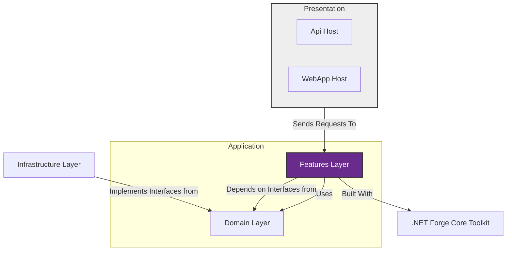

## Architecture
Version: 0.2 (Living Document)

Changelog 0.2:
* Added multi-ORM repository + UnitOfWork flexibility (EF Core primary; optional read-model providers).
* Added optional gRPC + Aspire hosting and client generation flexibility (Refit / Kiota / manual HttpClient).
* Introduced domain event post-commit dispatch via pipeline behavior.
* Emphasized composition over inheritance in toolkit extensions.

This solution uses the **Fused Slice Architecture**, a pragmatic and highly cohesive approach to building modern .NET applications. The project is organized into standard, recognizable layers, but with a unique set of principles and internal structures that make it powerful and productive.

### Architectural Layers

*   **`Domain` Layer:** Contains the core of your business logic. This includes your domain entities, value objects, smart enums, and the interfaces for your repositories (`IProductRepository`). This layer has no external dependencies.

*   **`Features` Layer:** This is the application's core. It contains all the use cases and business processes.
    *   **The "Flair": This layer implements the Fused Slice pattern.** Instead of organizing code by technical concern (e.g., `Commands/`, `Queries/`), we organize it by feature. All logic for a feature—its command, query, handler, DTOs, and validator—is **fused** into a single, self-contained `[FeatureName]Feature.cs` file. This maximizes cohesion and simplifies development.

*   **`Infrastructure` Layer:** Implements `Domain` abstractions (EF Core `DbContext`, repositories, specification evaluators, external service clients, UnitOfWork with transaction + post-commit domain event dispatch trigger). Optional alternate providers (Dapper/Linq2Db) for read/query optimization.

*   **`Presentation` Layer:** Entry points (Minimal API host, optional gRPC service, optional Aspire AppHost, UI). **Thin Adapters** that translate transport payloads into mediator requests and map `Result` to protocol responses (HTTP status, gRPC status). gRPC interceptors may provide tracing/validation/error translation. **No business logic here.**

*   **`Core` Library (NetForge Core Toolkit):** In-house implementations: Mediator, Result, Validation, Specification, Mapping, Domain primitives, Pipeline (Validation, UnitOfWork, future Logging/Caching/Timing), domain event abstractions—distributed as source for full ownership.

### Key Principles (Summary)

Refer to the rule catalog in `fused_slice_architecture.md`.

1. (FSA-01) Feature fusion: each feature resides in a single `[FeatureName]Feature.cs` file (requests, DTOs, validators, handlers, internal mapping).
2. (FSA-02) Thin adapters: presentation hosts only orchestrate mediator calls + result translation.
3. (FSA-04) Explicit results: all handlers return `Result` / `Result<T>` with structured errors (no control-flow exceptions).
4. (FSA-03, FSA-06, FSA-12) Repository + UnitOfWork abstractions enable multi-ORM flexibility; no direct `DbContext` in handlers; repos never commit.
5. (FSA-08) Specification-driven queries; provider evaluators translate specs.
6. (FSA-07) Domain events raised during state changes and dispatched post-commit.
7. (FSA-09) Composition over inheritance: extension methods + small interfaces preferred.
8. (FSA-15) Transport-agnostic core logic: HTTP, gRPC, messaging reuse the same features.
9. (FSA-13) Client flexibility: Refit, Kiota, or manual HttpClient wrappers with centralized resilience.
10. (FSA-14) Source-owned toolkit: adjust patterns freely as needs evolve.

Cross-Document Navigation: [Architecture Rules](./fused_slice_architecture.md) | [Toolkit](./netforge_core.md) | [Design Phases](./netforge_core_design.md) | [AI Prompt](./ai_prompt.md)
